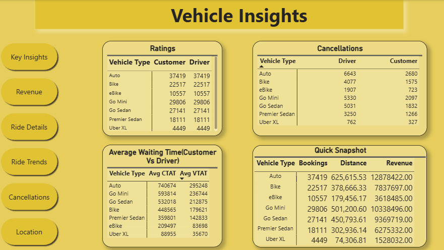

# Delhi-NCR-Ride-Analysis
Delhi NCR Ride Bookings analysis using Power BI. Analyzed 150K+ bookings and 51M+ revenue to optimize operational efficiency and track cancellation trends.
## Dashboard Preview

### Key Insights

### Revenue Analysis

### Ride Details

### Ride Trends

### Cancellation Analysis

### Location Insights

### Vehicle Insights

## Key Project Insights
* **Revenue & Volume:** Analyzed a massive dataset of **150K bookings** generating **51.8M in total revenue**.
* **Operational Efficiency:** Identified **Auto** as the top-performing vehicle type and tracked an **Average Ride Distance of 16.8 KM**.
* **Revenue Per Ride:** Calculated an **Average Revenue Per Ride of 345.6**, with top locations including Tughlakabad and Udyog Vihar.
* **Cancellation Analysis:** Maintained a detailed log of cancellation reasons, noting a low **0.38% cancellation rate**.
* **Demand Trends:** Visualized peak demand hours (6:00 PM) and identified the **Top 20 Demanding Locations** like Khandsa and Saket.

## Technical Skills Used
* **Power BI:** Multi-page dashboard development with dynamic navigation.
* **DAX:** Advanced measures for KPI tracking (Revenue, Booking Status, and AVG CTAT).
* **Data Modeling:** Robust schema to handle spatial (location) and temporal (time) data points.
